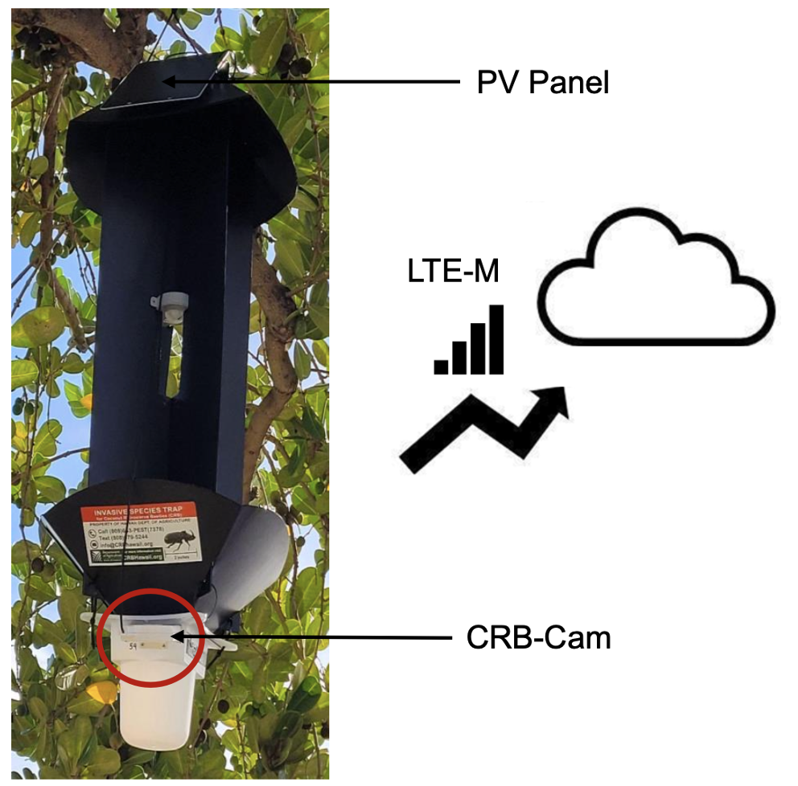
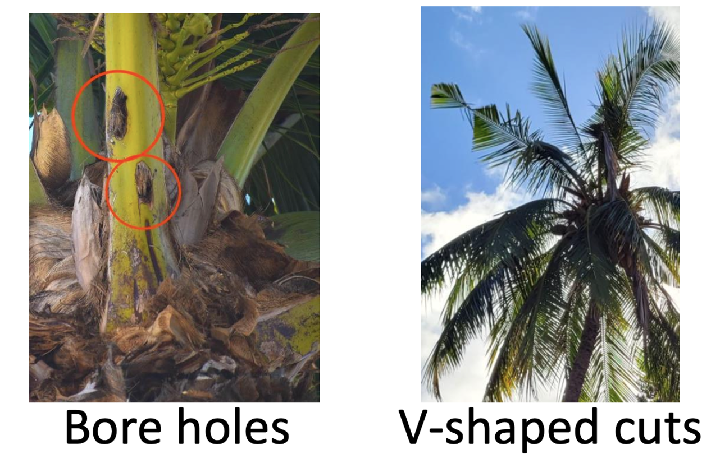
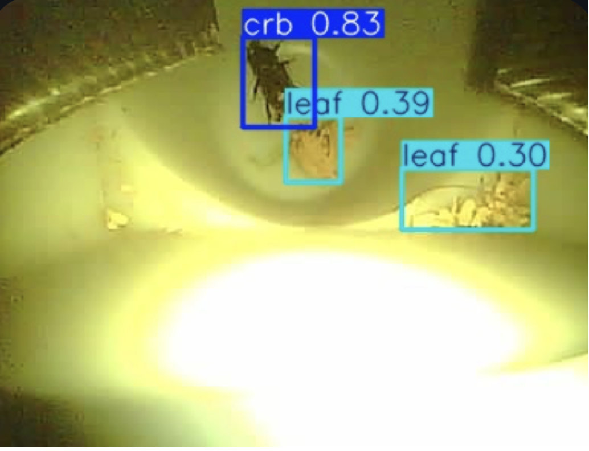
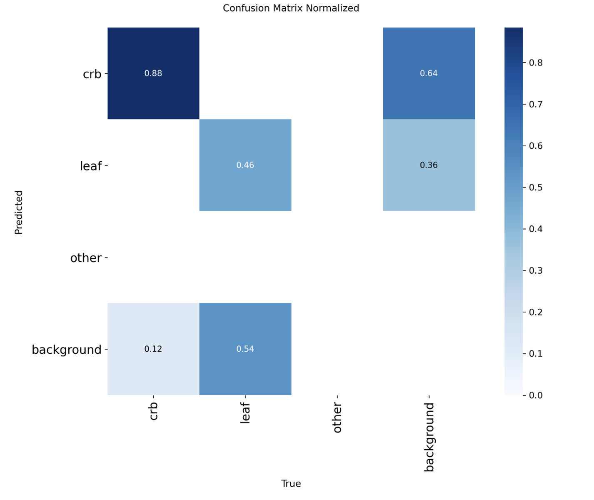
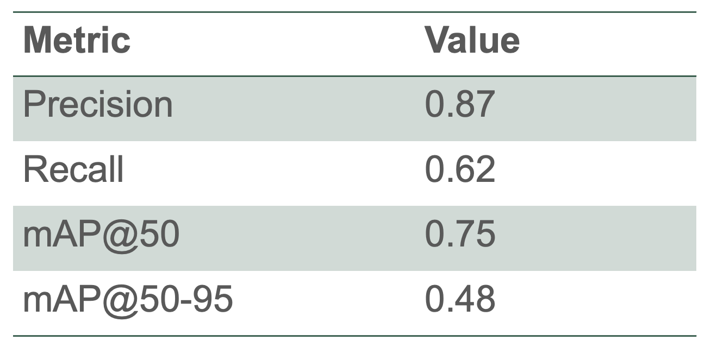
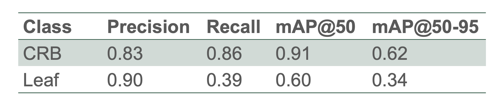
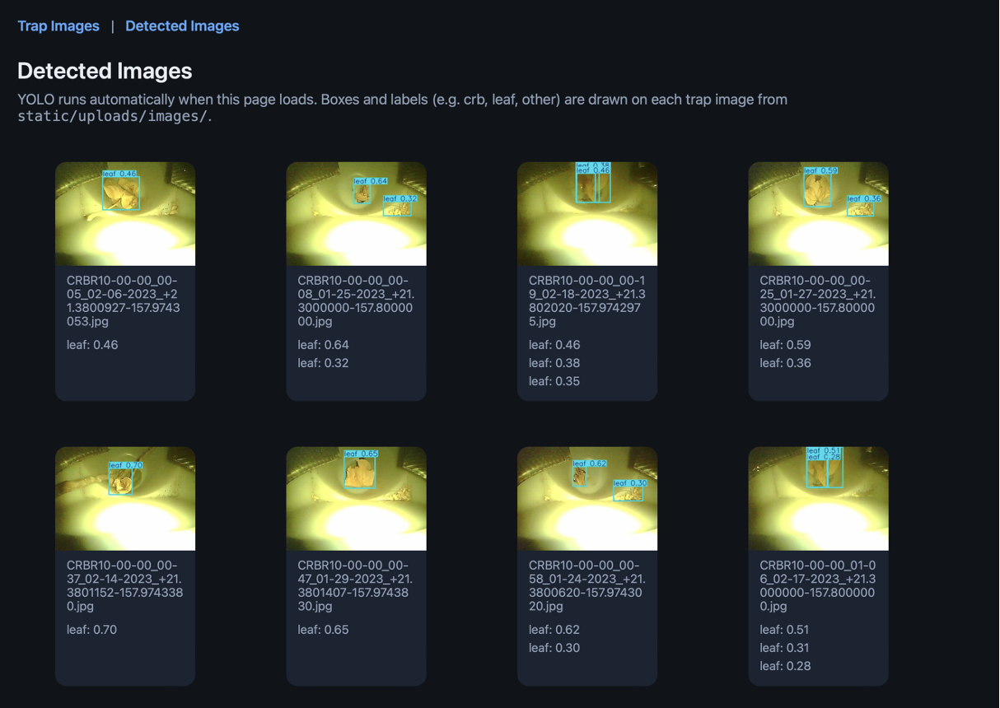

# AI-Powered CRB Detection (YOLOv8 + Flask)

## Workshop overview

This repository supports a workshop led by **Mohammad Aftab Uzzaman** as part of the **Hawaiʻi Data Science Institute (HIDSI)** Fellowship Program. The workshop shows how computer vision can help detect the **Coconut Rhinoceros Beetle (CRB)** in camera trap imagery.

---

## Motivation: Coconut Rhinoceros Beetle (CRB)

The Coconut Rhinoceros Beetle is a major pest in Hawaiʻi and can severely damage palm trees when populations are left unchecked. In the field, damage often shows up as bore holes, frass, and characteristic feeding marks on palms—patterns that are easier to spot when you know what to look for but tedious to review image by image. Manual screening of trap photos does not scale when many cameras run for long periods, which is why automated pipelines that combine IoT or field cameras with detection models are useful: they can flag frames for follow-up and make large image sets easier to work through.



*Courtesy: Dr. Mohsen Paryavi.*



*Courtesy: Dr. Mohsen Paryavi.*

---

## Object detection and YOLO

Object detection goes beyond asking “what class is in this image?” It answers both **what** is present and **where** it appears, usually by predicting **bounding boxes** around each object together with **class labels** and **confidence scores**. That matters for monitoring because beetles, leaves, and background clutter can all appear in the same frame: the model must localize instances, not only vote on the whole scene.

**YOLO** (“You Only Look Once”) is a family of detectors designed for speed: the network runs a small number of forward passes over the image to propose boxes and scores in one go rather than scanning with separate heavy stages. This workshop uses **Ultralytics YOLOv8**, which fits well with trap imagery where latency and a simple training loop in Colab matter for teaching and iteration.



---

## Model training (Google Colab)

Training is done in **Google Colab** with GPU. The notebook in this repo is:

| File | Role |
|------|------|
| [`Training_YOLOV8_Colab.ipynb`](Training_YOLOV8_Colab.ipynb) | End-to-end Colab workflow: Drive paths, dataset prep, YOLOv8 training |

The notebook is written for a **Colab + Google Drive** layout (see paths inside the notebook). Adjust paths if your Drive folder names differ.

### Dataset layout (YOLO)

The workshop dataset under [`Dataset/`](Dataset/) follows the usual YOLO layout:

- [`Dataset/images/`](Dataset/images/) — images (e.g. `.jpg`)
- [`Dataset/labels/`](Dataset/labels/) — one `.txt` label file per image (same base name)
- [`Dataset/crb.yaml`](Dataset/crb.yaml) — data YAML with **train / val / test** image paths and class names:

  - `0`: **crb**
  - `1`: **leaf**
  - `2`: **other**

In Colab, the notebook copies data from Drive into a local folder (e.g. `/content/crb_dataset_local/`), builds **train / val / test** splits (**70% / 20% / 10%**, `random.seed(42)`), and trains with `crb.yaml`.

### Training steps (from the notebook)

1. Install **ultralytics** and set **source** paths (Drive) and **local** working directory.
2. Create `train`, `val`, and `test` folders (each with `images/` and `labels/`).
3. Shuffle and split image filenames; copy each image and matching `.txt` label into the split folders; copy `crb.yaml` locally.
4. Load a pretrained **`yolov8m.pt`** model and call `model.train(...)` with parameters such as `epochs`, `imgsz=640`, `batch`, and `device` appropriate for Colab GPU (`cuda` in the notebook).

After training, export **`best.pt`** from the run you want to use in the Flask app.

---

## Model results and evaluation

The plots below come from an Ultralytics training run (validation on the held-out split). They summarize how the detector behaves overall and **per class**.

**Bias and limitations.** The sample used here is only a **small part** of a larger monitoring effort. In this subset there are **many more CRB examples than leaf** (and class balance varies by split). Models tend to follow the data: metrics can look strong on frequent classes and weaker on rare ones, so **results should be read as useful but not unbiased**—especially for **leaf**, where the model has less to learn from. Interpretation should stay tied to this workshop sample, not to full statewide conditions.



The **confusion matrix** compares **true class** (rows) to **predicted class** (columns). Brighter entries on the diagonal mean the model often assigns the correct label; off-diagonal mass shows which classes are confused with one another (for example, background or clutter mistaken for beetles or leaves).



**Overall model performance** summarizes headline metrics such as mean precision and mean recall across IoU thresholds (as reported by Ultralytics for the validation set). It gives a single snapshot of how the run did on average before drilling into individual classes.



**Class-wise performance** breaks metrics down by **crb**, **leaf**, and **other**. This is where imbalance shows up most clearly: classes with more training examples often dominate average scores, while rarer classes can have wider swings—consistent with the **leaf vs. CRB** imbalance noted above.

---

## Local prediction with Flask

The trained weights **`best.pt`** are loaded by a small **Flask** app that lists trap images from **`Flask_app/static/uploads/images/`**, runs **YOLO** inference when you open the detections page, saves annotated images to **`Flask_app/static/detected/`**, and shows results in the browser. Weights are loaded from [`Flask_app/weights/best.pt`](Flask_app/weights/best.pt) (see [`Flask_app/app/config.py`](Flask_app/app/config.py)).



---

## How to run the Flask app

All commands below assume you start from the **`Flask_app/`** directory (where `run.py` and `requirements.txt` live).

### macOS / Linux

```bash
cd Flask_app
python3 -m venv .venv
source .venv/bin/activate
pip install -r requirements.txt
python run.py
```

### Windows (Command Prompt / PowerShell)

```bash
cd Flask_app
python -m venv .venv
.venv\Scripts\activate
pip install -r requirements.txt
python run.py
```

Then open **http://127.0.0.1:5000** in your browser.

**What this does:** create an isolated Python environment, install **Flask**, **ultralytics**, **torch**, **OpenCV**, etc., start the dev server on port **5000**, and load the model once at startup (`run.py` calls `load_model()` before `app.run(...)`).

---

## Flask execution flow (how the code fits together)

1. **`Flask_app/run.py`** — Builds the app with `create_app()`, loads the YOLO model once via `load_model()`, runs Flask on `127.0.0.1:5000` with `debug=True`.
2. **`Flask_app/app/__init__.py`** — App factory: sets templates and `static/`, registers the blueprint from `routes.py`.
3. **`Flask_app/app/routes.py`** — Routes:
   - **`/`** — Lists images under `static/uploads/images/` (no inference).
   - **`/detected`** — Calls `build_detection_results()` in `ml.py` to run inference and render results.
4. **`Flask_app/app/ml.py`** — Loads **`weights/best.pt`** with Ultralytics **YOLO**, picks **CUDA → Apple MPS → CPU** when predicting, draws boxes with `r.plot()`, saves `*_detected.jpg` under `static/detected/`, and passes URLs and label strings to the template.
5. **`Flask_app/app/config.py`** — Central paths: `WEIGHTS_PATH`, `TRAP_IMAGES_DIR`, `DETECTED_DIR`, allowed image extensions.

---

## Repository layout (summary)

```
CRB_Detection_Workshop/
├── README.md
├── Training_YOLOV8_Colab.ipynb
├── Dataset/
│   ├── images/
│   ├── labels/
│   └── crb.yaml
├── docs/
│   └── HIDSI Workshop.pptx
└── Flask_app/
    ├── run.py
    ├── requirements.txt
    ├── weights/best.pt
    ├── app/
    │   ├── __init__.py
    │   ├── routes.py
    │   ├── ml.py
    │   ├── config.py
    │   └── templates/
    └── static/
        ├── uploads/images/
        └── detected/
```

---

## Acknowledgments

We thank **Dr. Daniel Jenkins** and **Dr. Mohsen Paryavi** for their guidance and support connected to this work. We are grateful to the **Hawaiʻi Data Science Institute (HIDSI)** and the **Hawaiʻi State Energy Office (HSEO)** for **funding** and for the fellowship context that made the workshop possible.
